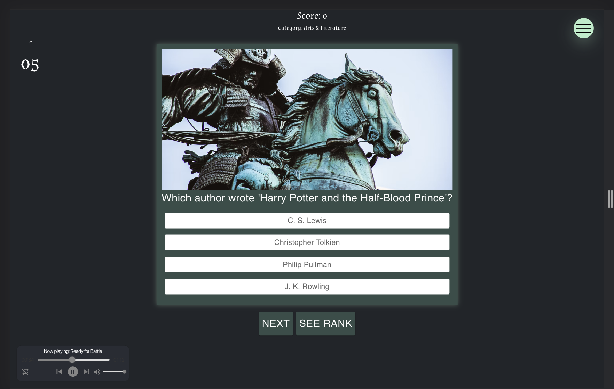

# Conquer The Crown

<strong>Purpose of the app:</strong>
Introducing Conquer The Crown! An interactive Trivia App, sprinkled with the Medieval Era. The nobleman can sign up with Google and track their score with the Firestore database.
  
<strong>How to use:</strong> User can choose to sign up or not, if they do, then their score will be tracked and stored on the Leaderboard. Begin by selecting difficulty of questions asked and the timer starts right away. You have 60 seconds to answer as many trivia questions correctly as you can before time runs out. The one with the highest score will be selected to lead the underground army that is forming to take down Genghis Khan and his brutal Empire.   

  

  <h3>Help us defeat Genghis Khan and his Mongol Empire</h2>

https://user-images.githubusercontent.com/94413237/183111696-14b6e5fd-e72e-4825-82bb-c1c0664c14d1.mp4

<!-- SITE PREVIEW -->

## Site Preview

  

## Technologies

React Redux, Google Firebaes, CSS, Material UI, Bootstrap, The Trivia Api

